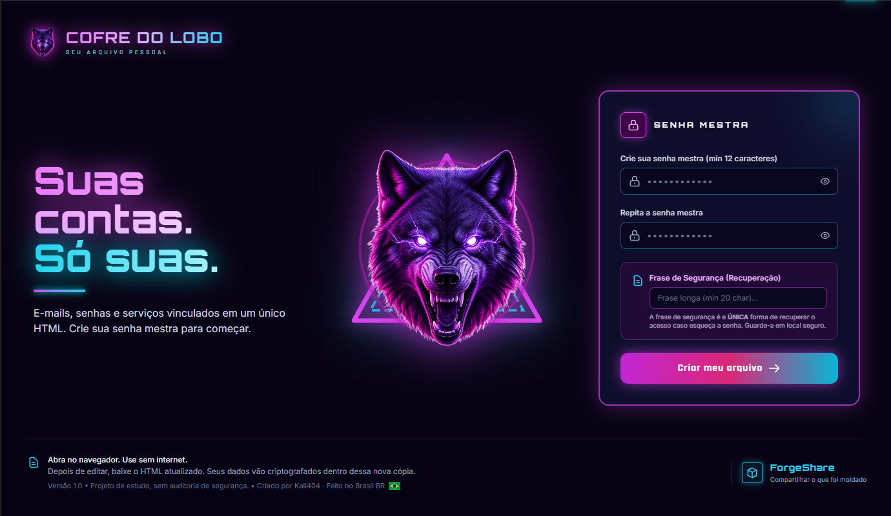
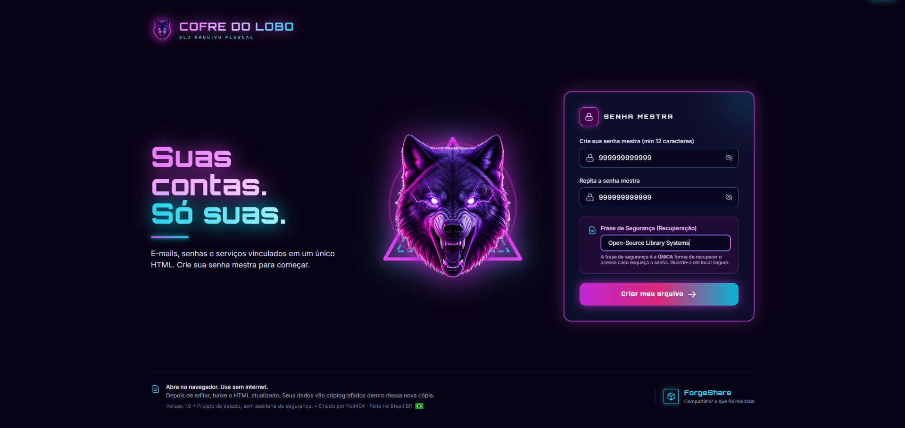
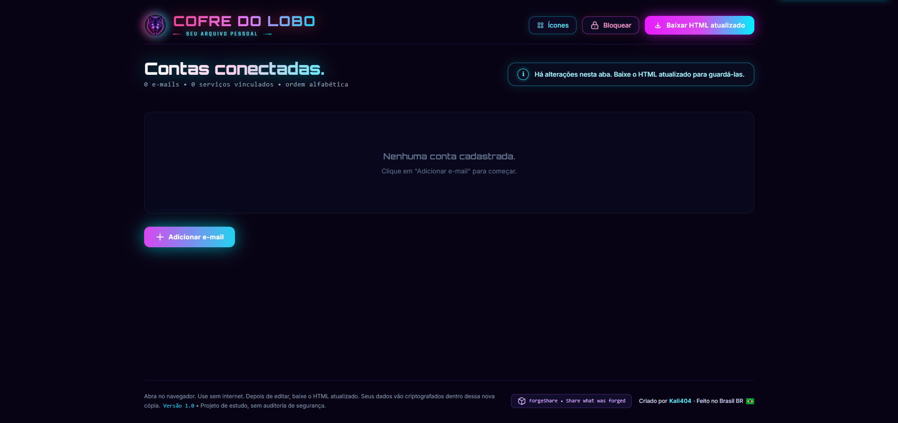
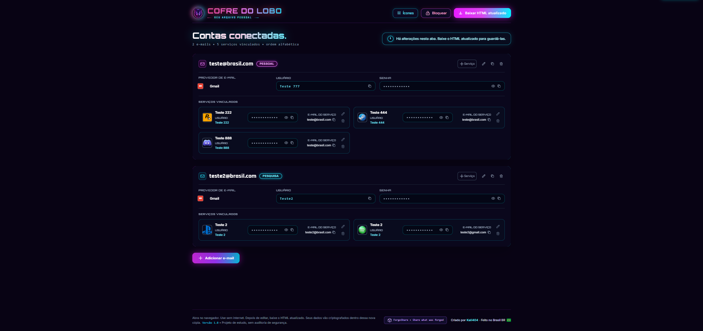
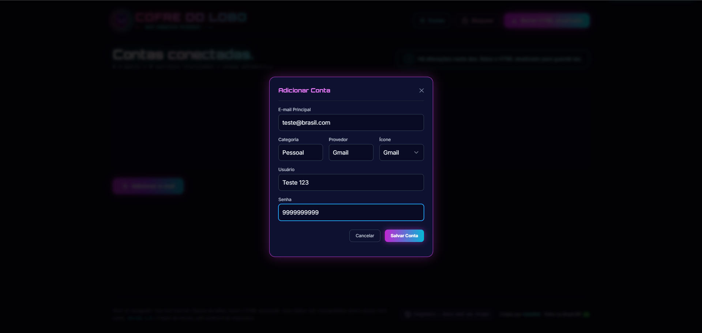

# Cofre do Lobo 


> Um cofre pessoal, local e criptografado para organizar e-mails, senhas e os serviços vinculados a cada conta.


## Por que este projeto existe?

O **Cofre do Lobo** nasceu de uma necessidade real: organizar muitos endereços de e-mail e os vários serviços vinculados a cada um deles, sem depender de uma planilha confusa ou de anotações espalhadas.

A proposta é reunir essas informações em uma interface visual, local e protegida por criptografia. Assim, cada pessoa pode administrar suas contas, serviços, usuários e senhas em um único arquivo, mantendo o controle dos próprios dados.

O projeto foi criado por **Kali404**, com foco em utilidade, privacidade e organização pessoal.

## Recursos

- Um único arquivo HTML, utilizável sem internet.
- Cofre protegido por senha mestre.
- Criptografia local com Web Crypto API: AES-GCM de 256 bits e derivação de chave PBKDF2/SHA-256.
- Frase de recuperação opcional.
- Cadastro de múltiplas contas de e-mail.
- Cadastro de serviços vinculados a cada conta.
- Serviços predefinidos e suporte a qualquer nome personalizado, como TikTok, Kwai, bilibili ou Krafton.
- Ícones predefinidos ou personalizados para contas e serviços.
- Exportação do cofre para outro HTML criptografado e utilizável offline.
- Layout responsivo para desktop e Android.

## Galeria

<p align="center">
  
  
</p>

<p align="center">
  
  
</p>

<p align="center">
  
</p>

*As imagens demonstram a interface com exemplos de teste. Nunca publique capturas contendo credenciais reais.*

## Como usar

1. Baixe `index.html` deste repositório.
2. Abra o arquivo em um navegador atualizado, como Chrome, Edge, Firefox ou Safari.
3. Crie uma senha mestre forte e, se desejar, configure uma frase de recuperação.
4. Cadastre suas contas e os serviços vinculados.
5. Use **Baixar HTML** sempre que quiser salvar uma cópia atualizada do cofre.

> O navegador não envia os dados do cofre para um servidor do projeto. Os dados permanecem no arquivo local, criptografados pela senha mestre.

## Segurança e transparência

O Cofre do Lobo é um projeto de código aberto: qualquer pessoa pode inspecionar o HTML e o JavaScript antes de utilizá-lo. Ele não instala programas, não executa arquivos externos e não depende de servidor próprio.

Ainda assim, segurança envolve boas práticas:

- Use uma senha mestre longa e exclusiva.
- Guarde a frase de recuperação em local seguro.
- Faça cópias de segurança do seu cofre em um local protegido.
- Nunca publique ou envie seu cofre pessoal para terceiros.
- Não envie ao GitHub um HTML que já contenha suas contas, mesmo que estejam criptografadas.

### Verificação no VirusTotal

Para aumentar a confiança da comunidade, o mantenedor pode enviar a versão **limpa**, antes de cadastrar dados, ao [VirusTotal](https://www.virustotal.com/gui/home/upload) e publicar o link do resultado em uma Release.

**Atenção:** não envie ao VirusTotal o seu HTML pessoal exportado com dados cadastrados. O serviço analisa arquivos enviados e pode compartilhá-los com a comunidade de segurança. Use apenas a cópia limpa distribuída neste repositório.

Também é possível conferir a integridade do arquivo no Windows:

```powershell
Get-FileHash .\index.html -Algorithm SHA256
```

Publique o valor retornado junto de cada Release para que outras pessoas possam comparar o arquivo baixado.

## Limitações conhecidas

- A recuperação dos dados depende da senha mestre ou da frase de recuperação configurada. Não há servidor capaz de restaurar uma senha perdida.
- Ícones adicionados por URL podem precisar de conexão para aparecer; prefira enviar uma imagem local para manter o uso totalmente offline.
- Este projeto é uma ferramenta de organização pessoal e não substitui uma auditoria profissional de segurança.

## Contribuições

Sugestões, correções e melhorias são bem-vindas. Leia [CONTRIBUTING.md](CONTRIBUTING.md) antes de abrir uma issue ou pull request.

Para relatar uma possível falha de segurança, siga [SECURITY.md](SECURITY.md).

## Licença

Este projeto é disponibilizado sob a [Licença MIT](LICENSE).

---

Criado por **Kali404** · Feito no Brasil 🇧🇷 


